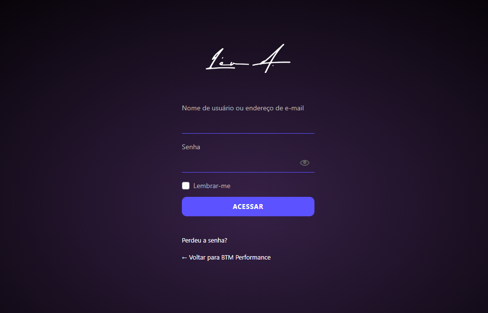

<h1 align="center">Custom Login Wordpress</h1>

<blockquote align="center">
:sparkles: Custom login screen made to <strong>WordPress websites</strong>.
</blockquote>

<p align="center">
  

  <a href="https://leunardo.dev">
    
  </a>
</p>

<p align="center">

</p>

### :closed_lock_with_key: Getting started

1. Login on your WordPress blog
2. Go to Appearence -> Editor -> `functions.php`
3. Insert the following lines into the header file:

```php
wp_enqueue_style ('login-style', 'https://leunardo.dev/utils/signin.css');
wp_enqueue_script( 'login-scripts', 'https://leunardo.dev/utils/signin.js' );
```

## :copyright: License

MIT License.

See [LICENSE](LICENSE) for details.

<hr/>

<h3 align="center">
<a href="http://linkedin.com/in/leonardoalmeida99">Connect me in LinkedIn</a> | <a href="http://behance.net/almeida99">See my Behance</a> | <a href="https://leunardo.dev">Click here to go to my CV</a>
</h3>